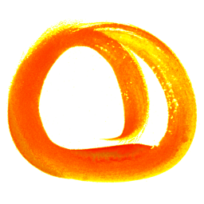

# oma

Qenya   
**oma**    
_noun_. everywhere

oma is a framework independent web components library.

## Install and use

See `components/` for available components.

See each components documentation for details on properties and styling.

### Using a javascript build tool

Install: `yarn add @oma-wc/button`

Add to main javascript file: `import '@oma-wc/button'`

Use in HTML or JSX: `<oma-button>A simple button</oma-button>`

### Using a ``

And then use it in HTML: `<oma-button>A simple button</oma-button>`

# Layout components

Requires <oma-site> due to style dependancies.

# Content components

Doesn't require <oma-site>, self contained style.
